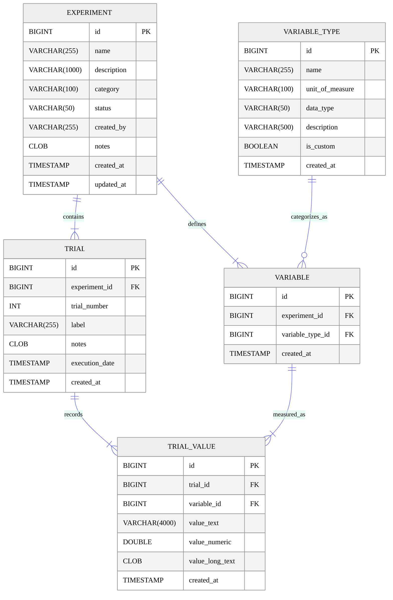

```mermaid
%%{init: {'theme': 'neutral', 'themeVariables': { 'primaryColor': '#e8f0fe', 'primaryTextColor': '#1a1a2e', 'primaryBorderColor': '#3b82f6', 'lineColor': '#6366f1', 'secondaryColor': '#fef3c7', 'tertiaryColor': '#d1fae5', 'noteBkgColor': '#f8fafc', 'noteTextColor': '#334155', 'fontFamily': 'Inter, system-ui, sans-serif' }}}%%

erDiagram
    EXPERIMENT ||--|{ TRIAL : contains
    EXPERIMENT ||--|{ VARIABLE : defines
    TRIAL ||--|{ TRIAL_VALUE : records
    VARIABLE ||--|{ TRIAL_VALUE : measured_as
    VARIABLE_TYPE ||--o{ VARIABLE : categorizes_as

    EXPERIMENT {
        BIGINT id PK
        VARCHAR(255) name
        VARCHAR(1000) description
        VARCHAR(100) category
        VARCHAR(50) status
        VARCHAR(255) created_by
        CLOB notes
        TIMESTAMP created_at
        TIMESTAMP updated_at
    }

    VARIABLE_TYPE {
        BIGINT id PK
        VARCHAR(255) name
        VARCHAR(100) unit_of_measure
        VARCHAR(50) data_type
        VARCHAR(500) description
        BOOLEAN is_custom
        TIMESTAMP created_at
    }

    VARIABLE {
        BIGINT id PK
        BIGINT experiment_id FK
        BIGINT variable_type_id FK
        TIMESTAMP created_at
    }

    TRIAL {
        BIGINT id PK
        BIGINT experiment_id FK
        INT trial_number
        VARCHAR(255) label
        CLOB notes
        TIMESTAMP execution_date
        TIMESTAMP created_at
    }

    TRIAL_VALUE {
        BIGINT id PK
        BIGINT trial_id FK
        BIGINT variable_id FK
        VARCHAR(4000) value_text
        DOUBLE value_numeric
        CLOB value_long_text
        TIMESTAMP created_at
    }
```